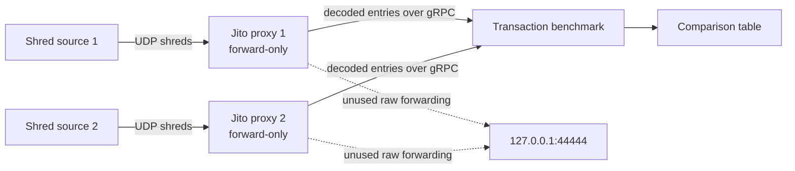

# Solana Shred Transaction Benchmark

Compare transaction arrival times from two Solana shred sources. The benchmark matches transactions by their first signature and reports which source delivered each matched transaction first, including mean, P50, and P95 lead times.

The project uses the official Jito ShredStream proxy `v0.2.14` binary. The launcher verifies its pinned SHA-256 digest before execution:

```text
1b30b8e3fb4212b30774e9a277c19d42e1ff058d76f444d05afacd2e8f747a70
```

## How it works



Each proxy independently reconstructs entries from its UDP stream. The benchmark timestamps decoded transactions as they arrive over local gRPC, deduplicates each source, and compares transactions observed by both sources. Transactions seen by only one source are reported separately and do not affect lead-time percentiles.

## Requirements

- x86_64 Linux
- `cargo`, `curl`, `git`, and `sha256sum`
- Two local IP/UDP ports where the upstream sources send shreds

Development and verification are performed on Ubuntu 24.04. The launcher uses POSIX `sh` and common Linux utilities to remain portable across other Linux distributions.

## Run

Pass all values when running non-interactively:

```sh
curl -fsSL https://raw.githubusercontent.com/Shred-One/solana-shred-tx-benchmark/main/start_benchmark.sh | \
  sh -s -- \
    --source-1-address 0.0.0.0:20000 \
    --source-1-name Jito \
    --source-2-address 0.0.0.0:20001 \
    --source-2-name Provider-B \
    --duration 60
```

Missing source addresses or names are prompted from `/dev/tty`, so the short interactive form also works:

```sh
curl -fsSL https://raw.githubusercontent.com/Shred-One/solana-shred-tx-benchmark/main/start_benchmark.sh | sh
```

From a local checkout:

```sh
./start_benchmark.sh
```

Use `./start_benchmark.sh --help` for all options, including custom local gRPC ports. The launcher clones this repository into a temporary directory when it is not run from a checkout, builds the locked release binary, starts both proxies, and cleans up the processes and temporary files when the benchmark exits.

## Output

The final table contains:

- `Unique tx`: distinct transactions decoded from that source.
- `First`: matched transactions delivered first by that source.
- `Win rate`: `First` divided by all matched transactions.
- `Mean/P50/P95 lead`: arrival-time advantage for transactions won by that source.

## Repository files

| File | Purpose |
|---|---|
| `src/main.rs` | Connects to both proxy streams, decodes transaction signatures, aggregates results, and prints the table. |
| `src/shredstream.rs` | Minimal generated gRPC client matching the Jito proxy protocol. |
| `start_benchmark.sh` | Downloads and verifies the pinned proxy, builds the benchmark when needed, starts both streams, and cleans up. |
| `.github/workflows/release.yml` | Tests pull requests and builds the release artifact after changes reach `main`. |
| `Cargo.toml` / `Cargo.lock` | Rust package definition and reproducible dependency lock. |

## Direct binary usage

The launcher is recommended, but the benchmark can connect to two already-running proxies:

```sh
cargo run --release --locked -- \
  --source-1-url http://127.0.0.1:19091 --source-1-name Jito \
  --source-2-url http://127.0.0.1:19092 --source-2-name Provider-B \
  --duration 60
```
