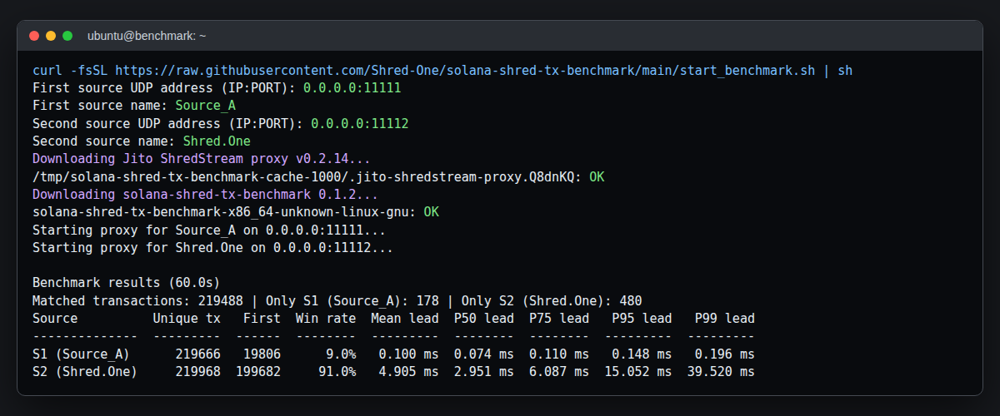
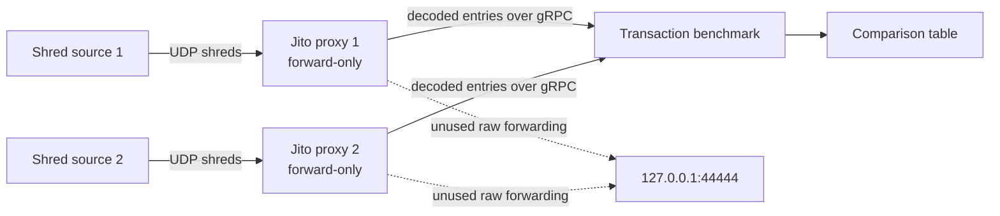

# Solana Shred Transaction Benchmark

Compare transaction arrival times from two Solana shred sources. The benchmark matches transactions by their first signature and reports which source delivered each matched transaction first, including mean, P50, P75, P95, and P99 lead times.

The project uses the official Jito ShredStream proxy `v0.2.14` binary. The launcher verifies its pinned SHA-256 digest before execution:

```text
1b30b8e3fb4212b30774e9a277c19d42e1ff058d76f444d05afacd2e8f747a70
```

## How it works





Each proxy independently reconstructs entries from its UDP stream. The benchmark waits until both gRPC subscriptions are ready, then gives both receiver tasks the same `Instant` measurement window. At the cutoff it stops both tasks and drains every transaction timestamped inside that window before reporting. Transactions seen by only one source are reported separately and do not affect lead-time percentiles.

## Requirements

- x86_64 Linux
- `curl`, `flock`, `sha256sum`, and `stat`
- Two local IP/UDP ports where the upstream sources send shreds

Building or running directly from source additionally requires Rust and Cargo.

Development and verification are performed on Ubuntu 24.04. The launcher uses POSIX `sh` and common Linux utilities to remain portable across other Linux distributions.

## Run

Pass all values when running non-interactively:

```sh
curl -fsSL https://raw.githubusercontent.com/Shred-One/solana-shred-tx-benchmark/main/start_benchmark.sh | \
  sh -s -- \
    --source-1-address 0.0.0.0:11111 \
    --source-1-name Source_A \
    --source-2-address 0.0.0.0:11112 \
    --source-2-name Shred.One \
    --duration 60
```

Missing source addresses or names are prompted from `/dev/tty`, so the short interactive form also works:

```sh
curl -fsSL https://raw.githubusercontent.com/Shred-One/solana-shred-tx-benchmark/main/start_benchmark.sh | sh
```

From a local checkout:

```sh
./start_benchmark.sh
```

Use `./start_benchmark.sh --help` for all options, including custom local gRPC ports. The launcher keeps verified binaries in `${TMPDIR:-/tmp}/solana-shred-tx-benchmark-cache-UID`; cleanup removes only runtime files and processes. It rejects cache paths with an unexpected type or owner before changing permissions or running cached files. The pinned Jito proxy is reused while its SHA-256 remains valid.

The first validated set of four source values is atomically saved as `source-config` with mode `600` in that per-UID cache. When no source option is passed later, the launcher displays a valid saved configuration and offers to reuse it with `[Y/n]`; an empty answer or `y` reuses it, while `n` prompts for all four values. Passing any source option bypasses reuse, keeps the supplied values, prompts only for missing values, and atomically replaces the saved configuration after validation. The file is parsed as exactly four plain-text lines and is never sourced or evaluated. Symlinks, non-regular files, unexpected owners or modes, control characters, and malformed contents are rejected or ignored before use as appropriate.

On the first run, the latest benchmark release is downloaded and recorded. Later runs keep using that verified cached version and only report when a newer release is available. Pass `--latest-update` to download, verify, and switch to the newest release. A damaged cache is restored from its recorded release before update handling, and a verified download is activated by an atomic metadata update. Cache operations hold an inter-process lock; the operating system releases this lock automatically if a launcher exits unexpectedly. Set `SOLANA_SHRED_TX_BENCHMARK_BIN` to an executable path to bypass benchmark release and cache handling with a specific local binary instead.

## Releases

After each update to `main`, a dedicated workflow tests the code, builds it for Linux x86_64 in a read-only job, and passes the binary and checksum to a minimal publishing job. Its stable workflow run number plus `RELEASE_VERSION_OFFSET` maps the first update to `0.1.0`, the second to `0.1.1`, and so on. The version is independent of merge strategy, commit count, and completion order; rerunning the same workflow run keeps the same version. The publishing job repairs missing or partial assets, publishes an interrupted draft, and verifies that the release is public before succeeding.

`.github/workflows/publish-release.yml` is the persistent identity of the release sequence. Do not move, rename, delete, or recreate it. If an identity change is unavoidable, set `RELEASE_VERSION_OFFSET` in the replacement workflow to the next unused patch number before its first run; for example, use `13` when the latest release is `0.1.12`. Keep this workflow limited to `push` events on `main`, because every new workflow run consumes one sequence number.

A failed or cancelled release run also keeps its sequence number. To preserve a continuous published series, rerun it and confirm that its release is public before the next update is merged into `main`. A later run advances to the next version and does not fill an earlier gap automatically.

## Output

When stdout is a terminal, a dedicated renderer updates one bounded in-place progress line every 200 ms with elapsed time and the cumulative unique transaction counts for `S1` and `S2`. The measurement loop only replaces a single latest-state slot, so slow terminal output cannot create a transaction backlog. Redirected output stays static. The progress line is cleared before the final table, after Ctrl+C, or on an error.

The final table sizes every column from its complete set of cells. Source names are shown with stable `S1`/`S2` aliases, limited to 32 characters, and non-ASCII or terminal-control characters are replaced with `?` so alignment and terminal state remain safe without locale-specific dependencies.

The final aligned table contains:

- `Unique tx`: distinct transactions decoded from that source.
- `First`: matched transactions delivered first by that source.
- `Win rate`: `First` divided by all matched transactions.
- `Mean/P50/P75/P95/P99 lead`: arrival-time advantage for transactions won by that source.

Percentiles use nearest-rank: for `n` sorted lead times, percentile `p` selects the 1-based rank `ceil(n * p)`.

## Repository files

| File | Purpose |
|---|---|
| `src/main.rs` | Connects to both proxy streams, decodes transaction signatures, aggregates results, and prints the table. |
| `src/shredstream.rs` | Minimal generated gRPC client matching the Jito proxy protocol. |
| `start_benchmark.sh` | Caches verified proxy and benchmark binaries, starts both streams, and cleans up runtime files. |
| `tests/start_benchmark_cache.sh` | Exercises binary cache behavior plus safe source-configuration prompts, reuse, overrides, and recovery. |
| `.github/workflows/release.yml` | Tests pull requests. |
| `.github/workflows/publish-release.yml` | Tests updates to `main`, then publishes a tagged Linux x86_64 binary and checksum. |
| `Cargo.toml` / `Cargo.lock` | Rust package definition and reproducible dependency lock. |

## Direct binary usage

The launcher is recommended, but the benchmark can connect to two already-running proxies:

```sh
cargo run --release --locked -- \
  --source-1-url http://127.0.0.1:19091 --source-1-name Jito \
  --source-2-url http://127.0.0.1:19092 --source-2-name Provider-B \
  --duration 60
```
